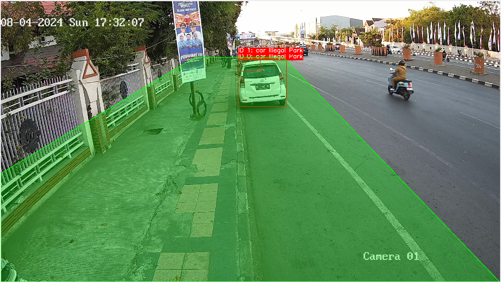
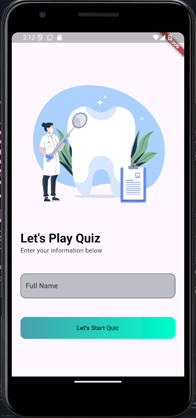

# Hi there! 👋 I'm Keane Athallah

Welcome to my GitHub profile! I'm passionate about Web Development/Machine Learning, and I enjoy building innovative projects that solve real-world problems. My journey as a developer is fueled by curiosity, creativity, and a strong desire to make an impact. Here's a little more about me and what I'm working on.

## 🚀 Projects

### 1. [Project Name: Real-time Surveillance System for Prohibited Parking Areas]

 <!-- Replace with the correct path to your image -->

- **Description:** This project integrates advanced machine learning algorithms, specifically YOLOv8, for detecting illegal parking. It has achieved a 92% detection accuracy. Future developments include predictive analytics and integration with smart city infrastructure.
- **Tech Stack:** Python 3.11, YOLOv8, CCTV Cameras, Smart City Integration
- **Achievements:** Improved detection accuracy and reduced violations, contributing to smarter urban management.

### 2. [Project Name: Denkids - Educational App for Children]

 <!-- Replace with the correct path to your image -->

- **Description:** Denkids is an educational mobile application aimed at children. It includes quiz games and educational animation videos to make learning fun and engaging. Developed using Flutter and Dart, it combines interactive content with a user-friendly interface.
- **Tech Stack:** Flutter, Dart, Animation Videos, Quiz Games
- **Achievements:** Successfully created an interactive learning environment that has been well-received by both children and educators.

## 🌱 What I'm Currently Learning

I'm always looking to grow and improve my skill set. Right now, I'm focusing on:

- Enhancing my knowledge of predictive analytics and AI-driven insights
- Exploring new features in Flutter and Dart for mobile app development
- Experimenting with different data distribution techniques for smaller sample sizes

## 💬 Let's Connect!

Feel free to reach out if you want to collaborate on a project, have a question, or just want to chat about tech and innovation. I'm always open to new ideas and opportunities.

- **LinkedIn:** [https://www.linkedin.com/in/keane-athallah-290082275/](https://www.linkedin.com/in/keane-athallah-290082275/)
- **Email:** [keane.athall@gmail.com](mailto:keane.athall@gmail.com)

## 📊 GitHub Stats

## 🏆 Achievements

- **YOLOv8 Detection Accuracy:** 92%
- **Mobile App Development:** Successfully launched Denkids with engaging educational content

Thanks for visiting my profile! 😊
