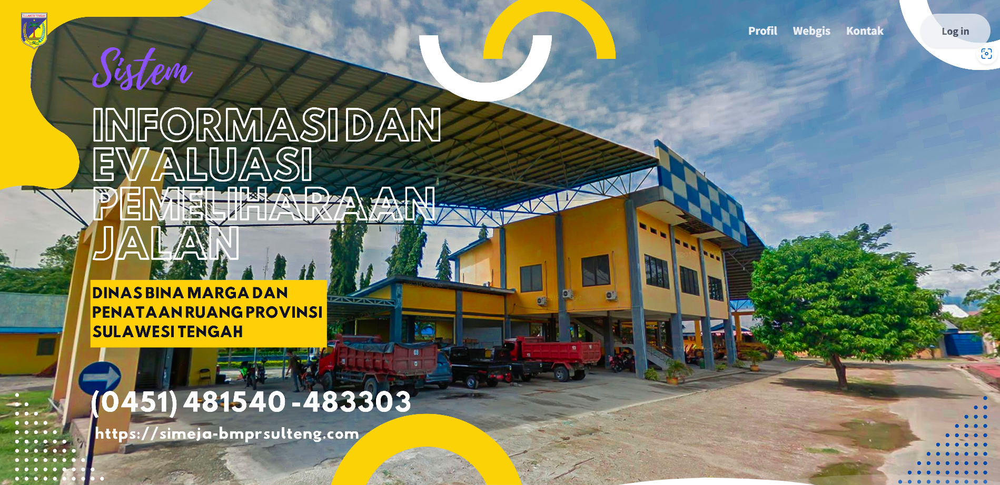
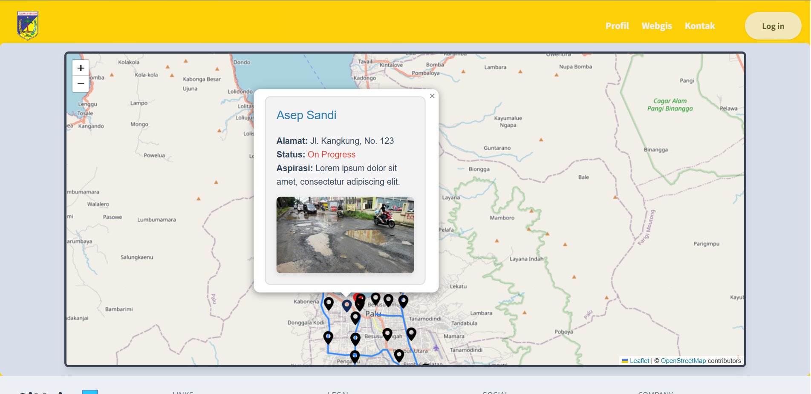
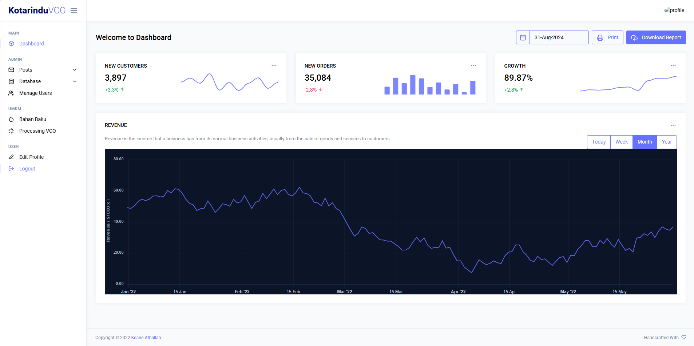
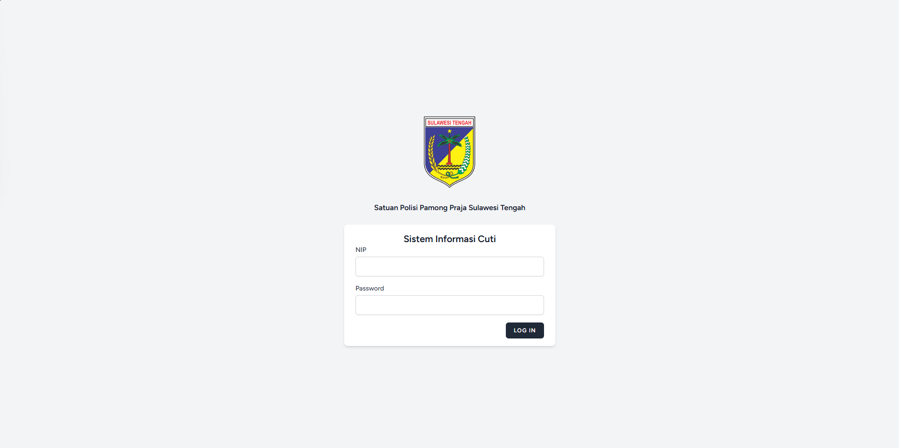
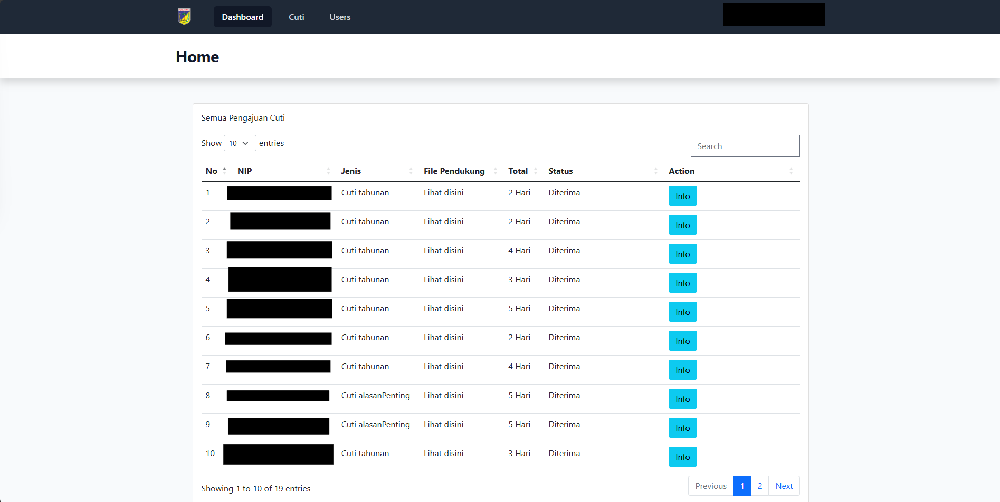
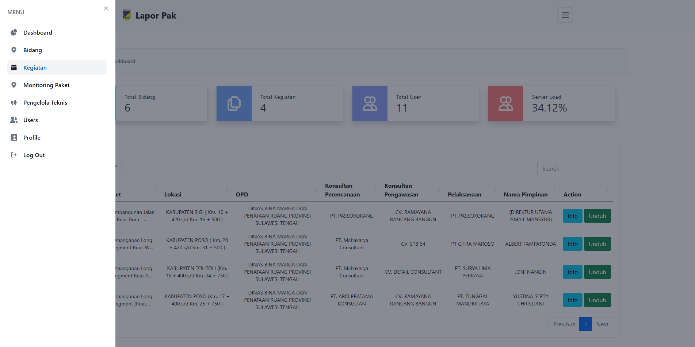

# Hi there! 👋 I'm Keane Athallah

Welcome to my GitHub profile! I'm passionate about Web Development and Machine Learning, and I enjoy building innovative projects that solve real-world problems. My journey as a developer is fueled by curiosity, creativity, and a strong desire to make an impact. Here's a little more about me and what I'm working on.

## 🚀 Projects

### 1. [Simeja - A Comprehensive Time Off Management System](https://github.com/yourusername/your-repo)

 <!-- Replace with the correct path to your image -->

- **Description:**  A public reporting platform for road damage complaints directed to Bina Marga in Central Sulawesi. Simeja simplifies the processing of field survey data and performs complex calculations to accurately analyze survey results.
- **Tech Stack:** Laravel, Tailwind CSS, MySQL,
- **Achievements:** Streamlined public reporting and field data processing for road condition surveys, improving accuracy in reporting and enabling faster analysis with complex survey data calculations.
Website Preview:
 <!-- Replace with the correct path to your image -->
### 2. [Real-time Surveillance System for Prohibited Parking Areas](https://github.com/yourusername/your-repo)

 <!-- Replace with the correct path to your image -->

- **Description:** This project integrates advanced machine learning algorithms, specifically YOLOv8, for detecting illegal parking. It has achieved a 92% detection accuracy. Future developments include predictive analytics and integration with smart city infrastructure.
- **Tech Stack:** Python 3.11, YOLOv8, CCTV Cameras, Smart City Integration
- **Achievements:** Improved detection accuracy and reduced violations, contributing to smarter urban management.

### 3. [Denkids - Educational App for Children](https://github.com/yourusername/denkids)

 <!-- Replace with the correct path to your image -->

- **Description:** Denkids is an educational mobile application aimed at children. It includes quiz games and educational animation videos to make learning fun and engaging. Developed using Flutter and Dart, it combines interactive content with a user-friendly interface.
- **Tech Stack:** Flutter, Dart, Animation Videos, Quiz Games
- **Achievements:** Successfully created an interactive learning environment that has been well-received by both children and educators.

### 4. [Kotarindu](https://kotarindu.co.id/)

 <!-- Replace with the correct path to your image -->

- **Description:** Kotarindu is a comprehensive data gathering platform for micro, small, and medium enterprises (MSMEs) with a focus on Virgin Coconut Oil (VCO) production. Built using the Laravel framework, this website is designed to collect and analyze data, ultimately leading to the development of a machine learning model that categorizes VCO types and offers recommendations for their production. Additionally, Kotarindu features a blog for articles about VCO and serves as a company profile for PT. SAMAMAJJA PRAGATI KOTARINDU.
- **Tech Stack:** Laravel, Machine Learning (future integration), Blog Integration
- **Achievements:** Laid the foundation for data-driven insights into VCO production, supporting the growth and innovation of MSMEs.
- **Website Preview:**  
   <!-- Replace with the correct path to your image -->

### 5. [SIMCuti PolPP Sulteng](https://simcutipolppsulteng.my.id/login)

 <!-- Replace with the correct path to your image -->

- **Description:** SIMCuti PolPP Sulteng is an online leave management system developed for the government instance Satuan Polisi Pamong Praja Sulawesi Tengah. Built using the Laravel framework, this system streamlines the leave request and approval process for government employees, making it more efficient and transparent.
- **Tech Stack:** Laravel
- **Achievements:** Successfully implemented a digital solution for managing leave processes, improving administrative efficiency within the government sector.
- **Website Preview:**  
   <!-- Replace with the correct path to your image -->

### 6. [LaporPak](https://laporpak.bmprsulteng.com/)

 <!-- Replace with the correct path to your image -->

- **Description:** LaporPak is a reporting system for Pelaporan Pelaksanaan Aktifitas Pekerjaan (LAPOR PAK) used by Dinas Bina Marga dan Penataan Ruang Provinsi Sulawesi Tengah. Built on the Laravel framework, it simplifies and automates the process of reporting work activities, making the reporting process more efficient and effective.
- **Tech Stack:** Laravel
- **Achievements:** Enhanced the accuracy and timeliness of work activity reporting, contributing to better resource management and project tracking.
- **Website Preview:**  
   <!-- Replace with the correct path to your image -->

## 🌱 What I'm Currently Learning

I'm always looking to grow and improve my skill set. Right now, I'm focusing on:

- **Enhancing my knowledge of predictive analytics and AI-driven insights:** Delving deeper into data science techniques to extract meaningful patterns and drive intelligent decision-making.
- **Exploring new features in Flutter and Dart for mobile app development:** Building more robust and feature-rich applications to provide better user experiences.
- **Experimenting with different data distribution techniques for smaller sample sizes:** Improving data handling and analysis methods to work efficiently with limited data.
- **NEXT.js:** Exploring the power of server-side rendering and static site generation to create fast, SEO-friendly web applications.
- **MERN Stack (MongoDB, Express.js, React, Node.js):** Mastering the full stack to build modern, scalable, and dynamic web applications that provide seamless user interactions and robust backend services.

These technologies are helping me push the boundaries of what I can create, and I'm excited to apply them in future projects!

## 🧑‍💼 Experience

### Dinas Bina Marga dan Penataan Ruang Provinsi | Palu, Sulawesi Tengah 

**Freelance Web Developer | 10/2024 - 11/2024**  

- Developed **[Simeja - A Comprehensive Time Off Management System](https://simeja-bmprsulteng.com/)**, a public reporting platform for road damage complaints directed to Bina Marga in Central Sulawesi.  
- Simplified the processing of field survey data and performed complex calculations to analyze survey results accurately.  
- **Tech Stack:** Laravel, Tailwind CSS, MySQL.  
- **Achievements:** Streamlined public reporting and field data processing for road condition surveys, improving reporting accuracy and enabling faster analysis.  

### Dinas Bina Marga dan Penataan Ruang Provinsi | Palu, Sulawesi Tengah 

**Freelance Web Developer | 07/2024 - 08/2024**  

- Developed **[Lapor Pak - Work Activity Reporting System](https://laporpak.bmprsulteng.com/)**, used by Dinas Bina Marga dan Penataan Ruang Provinsi Sulawesi Tengah.  
- Automated and simplified the work activity reporting process for government projects.  
- **Tech Stack:** Laravel, Tailwind CSS, MySQL.  
- **Achievements:** Enhanced the accuracy and efficiency of work activity reporting, contributing to better resource management and project tracking.

### Satuan Polisi Pamong Praja Sulawesi Tengah | Palu, Sulawesi Tengah  

**Freelance Web Developer | 06/2024 - 07/2024** 

- Developed **[SIMCuti PolPP Sulteng](https://simcutipolppsulteng.my.id/login)**, an online leave management system for government employees of Satuan Polisi Pamong Praja Sulawesi Tengah.  
- Streamlined the leave request and approval process, making it more efficient and transparent.  
- **Tech Stack:** Laravel, Tailwind CSS, MySQL.  
- **Achievements:** Successfully implemented a digital solution for managing leave processes, improving administrative efficiency within the government sector.  

### PT. Samamajja Pragati Kotarindu | Palu, Sulawesi Tengah

**Freelance Web Developer | 10/2023 - 12/2023**

- Developed comprehensive company profile websites with full-featured functionality tailored to client specifications.
- Engineered intuitive dashboards for micro, small, and medium-sized businesses specializing in Virgin Coconut Oil (VCO) production.
- Implemented robust data management systems to optimize VCO production methods and enhance quality grading processes.

### Kementrian Palu Utara | Palu, Sulawesi Tengah

**Freelance Web Developer | 08/2023 - 08/2023**

- Developed a comprehensive survey platform to gauge public satisfaction, featuring a real-time satisfaction index and a mechanism for anonymous feedback and suggestions.
- Integrated a robust dashboard management system for administrative oversight and data analytics.

### PT. Insan Mandiri Nekatama | Makassar, Sulawesi Selatan

**Intern Web Developer | 03/2023 - 05/2023**

- Developed a company profile website that showcases the company’s services and products in an interactive and user-friendly manner.
- Integrated an attendance feature that enables employers to keep track of their employees’ work hours and attendance records.
- Enhanced employer oversight by implementing a system that provides real-time updates on employee performance and productivity.

### Dinas Kementrian Komunikasi dan Informatika | Gowa, Sulawesi Selatan

**Internship Student | 06/2022 - 08/2022**

- Orchestrated a mayoral conference call that brought together key stakeholders to discuss the city’s priorities and challenges.
- Engineered a robust networking setup that enabled seamless communication between the participants and ensured that the call was conducted without any technical glitches.

## 🛠 Skills

- **Programming Languages:** HTML5, CSS3, JavaScript, PHP, Python, MySQL, Dart
- **Frameworks & Libraries:** Next.js, Laravel, React, Flutter
- **Specializations:** Computer Vision, Data Analysis, IoT Implementations, Web Development, Mobile App Development
- **Tools & Technologies:** Git, GitHub, AWS Cloud, SQL, Data Visualization

## 💬 Let's Connect!

Feel free to reach out if you want to collaborate on a project, have a question, or just want to chat about tech and innovation. I'm always open to new ideas and opportunities.

- **LinkedIn:** [https://www.linkedin.com/in/keane-athallah-290082275/](https://www.linkedin.com/in/keane-athallah-290082275/)
- **Email:** [keane.athall@gmail.com](mailto:keane.athall@gmail.com)

## 📊 GitHub Stats

## 🏆 Achievements

- **YOLOv8 Detection Accuracy:** 92%
- **Mobile App Development:** Successfully launched Denkids with engaging educational content
- **Data-Driven Insights:** Pioneered a data collection system for VCO production through Kotarindu
- **Government Efficiency:** Implemented SIMCuti PolPP Sulteng, enhancing leave management for government employees
- **Work Activity Reporting:** Streamlined reporting processes with LaporPak, improving project management efficiency
- **Public Reporting Platform:** Developed Simeja, a public platform for reporting road damage complaints to Bina Marga in Central Sulawesi, simplifying field data processing and enabling precise analysis with complex survey data.

Thanks for visiting my profile! 😊
